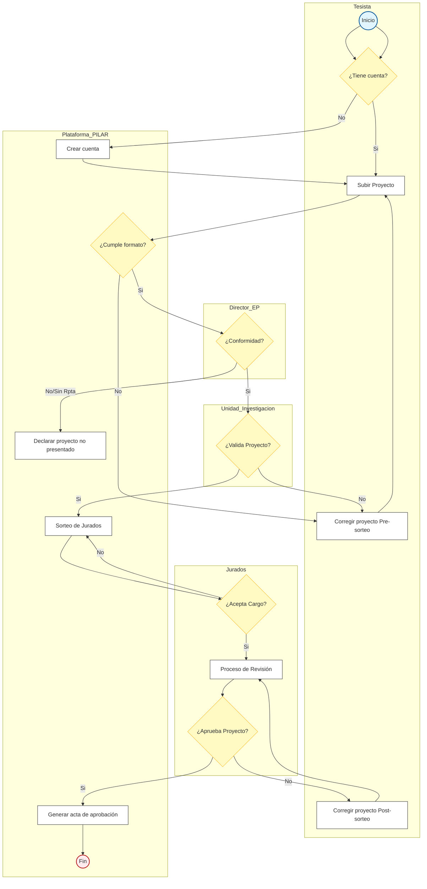

# Proceso de Titulación de Pregrado (TO BE) - UNAP

Este repositorio contiene la documentación y el modelamiento del **Proceso de Titulación de Pregrado de la Universidad Nacional del Altiplano (UNAP)**, enfocado en la propuesta de mejora **TO BE**. El objetivo es optimizar la gestión de tesis a través de la plataforma PILAR, eliminando cuellos de botella y mejorando la transparencia institucional.

## 📋 Descripción General
El proceso "TO BE" propone una transición digital completa, donde la interacción entre el tesista, los jurados y las unidades académicas se centraliza en una plataforma única. Esto reduce los tiempos de espera y automatiza tareas administrativas como el sorteo de jurados y la generación de actas.

## 👥 Actores y Roles
*   **Tesista:** Estudiante que inicia el trámite, sube el proyecto de tesis (borrador + reporte de similitud) y realiza las correcciones solicitadas.
*   **Plataforma PILAR:** Sistema que centraliza la información, valida formatos, realiza sorteos electrónicos y genera documentos oficiales.
*   **Director (Escuela Profesional):** Responsable de la primera revisión de conformidad según el plan de estudios.
*   **Unidad de Investigación (VRI):** Entidad que valida técnicamente el proyecto antes del sorteo de jurados.
*   **Jurado:** Docentes encargados de la revisión técnica, dictaminación y aprobación final del proyecto.

## 🛠️ Flujo de Datos y Proceso (TO BE)

A continuación se detalla el flujo de trabajo optimizado para la aprobación de proyectos de tesis:

### Diagrama de Flujo del Proceso

## 🚀 Mejoras Implementadas (Propuesta TO BE)
Basado en el análisis de puntos de dolor (Pain Points), el modelo TO BE aborda:
1.  **Transparencia:** El tesista puede ver en qué estado se encuentra su trámite en tiempo real.
2.  **Agilidad:** El sorteo de jurados es automático, evitando demoras por asignaciones manuales.
3.  **Digitalización:** Se eliminan los expedientes físicos, reduciendo costos y el impacto ambiental.
4.  **Validación Continua:** Filtros previos (Director y Unidad) aseguran que solo lleguen al jurado proyectos que cumplan con los estándares mínimos.

## 📈 Impacto Académico
La implementación de este proceso garantiza:
*   Reducción significativa en el tiempo de aprobación de proyectos.
*   Mayor equidad en la carga académica de los jurados.
*   Repositorio centralizado de actas y dictámenes para auditorías de calidad académica.

---
*Documentación generada para el curso de Ingeniería de Procesos - 2025-II.*
